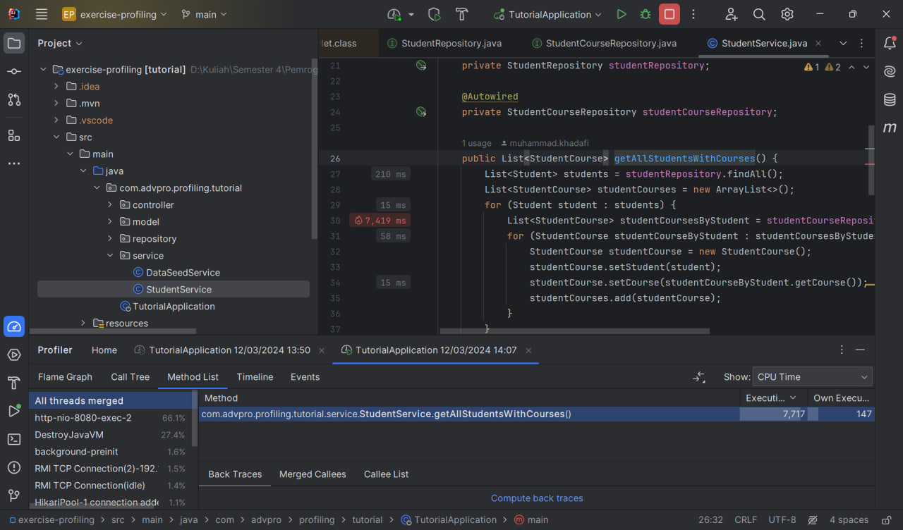

## Module 5

Reflection

### /all-student

#### Before

#### After

### /all-student-name

#### Before

#### After

### /highest-gpa

#### Before

#### After

Setelah dilakukan optimisasi pada kode, terjadi peningkatan performa pada setiap _method_. Peningkatan performa tersebut bervariasi antar _method_. Peningkatan tertinggi terjadi pada _method_ `getAllStudentsWithCourses` yang mencapai lebih dari 70% peningkatan performa.

---

1. What is the difference between the approach of performance testing with JMeter and profiling with IntelliJ Profiler in the context of optimizing application performance?

    Jmeter berguna untuk mengetes performa aplikasi secara keseluruhan. Jmeter dapat mesimulasikan ketika suatu _api_ diakses oleh banyak orang. Jmeter juga hanya memberikan informasi waktu dari awal _request_ dikirimkan hingga _response_ diterima. Di sisi lain, IntelliJ Profiler tidak mensimulasikan ketika _api_ diakses oleh banyak orang. Namun, IntelliJ Profiler dapat memberikan informasi yang lebih mendetail, seperti waktu spesifik dari setiap _method_ yang dipanggil untuk menyelesaikan suatu _request_.

2. How does the profiling process help you in identifying and understanding the weak points in your application?

    Profiler memberikan informasi yang mendetail mengenai seluruh proses yang terjadi untuk menyelesaikan suatu _request_. Terdapat informasi seperti _total time_ dan _cpu time_ dari setiap _method_ yang terlibat. Hal ini membantu saya dalam menemukan di bagian mana program memakan waktu paling banyak.

3. Do you think IntelliJ Profiler is effective in assisting you to analyze and identify _bottlenecks_ in your application code?

    Ya, IntelliJ Profiler sangat membantu saya dalam mengidentifikasi _bottlenecks_ pada aplikasi saya. Profiler sudah terintegrasi langsung pada IDE sehingga proses untuk melakukan _performance testing_ lebih cepat. Alat-alat yang disediakan oleh Profiler juga sudah sangat lengkap sehingga akan sangat membantu saya ketika mengidentifikasi _bottlenecks_.

4. What are the main challenges you face when conducting performance testing and profiling, and how do you overcome these challenges?

    Tantangan yang saya hadapi diantaranya adalah alat-alat untuk melakukan _performance testing_ dan _profiling_ belum pernah saya gunakan sebelumnya sehingga saya agak kesulitan dalam menggunakan alat-alat tersebut. Solusinya saya bertanya dulu kepada teman saya yang sudah lebih dulu mengerjakan tutorial ini. Selain itu, saya juga agak kurang yakin apakah _improvement_ yang saya lakukan ini sudah cukup baik atau masih bisa lebih baik lagi. Untuk mengatasi ini diperlukan latihan terus menerus hingga akhirnya terbiasa menuliskan kode secara efisien dan efektif.

5. What are the main benefits you gain from using IntelliJ Profiler for profiling your application code?

    Manfaat yang paling saya rasakan adalah saya mudah menemukan sumber masalah di kode saya. Profiler sudah mengurutkan setiap _method_ berdasarkan waktu eksekusinya. Hal ini membuat saya tidak perlu repot-repot lagi mencari _method_ mana yang paling bermasalah.

6. How do you handle situations where the results from profiling with IntelliJ Profiler are not entirely consistent with findings from performance testing using JMeter?

    Pertama, saya akan melakukan pengujian ulang karena bisa saja perbedaan hasil tersebut disebabkan oleh JIT compiler pada JVM yang belum optimal. Jika masih terdapat perbedaan yang besar, saya akan mengecek apakah terdapat perbedaan konfigurasi pada testing yang dijalankan oleh Profiler dan Jmeter.

7. What strategies do you implement in optimizing application code after analyzing results from performance testing and profiling? How do you ensure the changes you make do not affect the application's functionality?

    Setelah saya mendapatkan hasil analisis dari _performance testing_ dan _profiling_, saya akan mengganti kode yang ada pada _method_ yang bermasalah dengan kode yang lebih efisien, seperti mengganti struktur data dengan yang lebih efisien atau mengurangi kompleksitas algoritma. Setelah itu, saya akan melakukan testing, seperti unitTests dan functionalTests untuk memastikan perubahan yang dilakukan tidak mempengaruhi fungsionalitas aplikasi.

